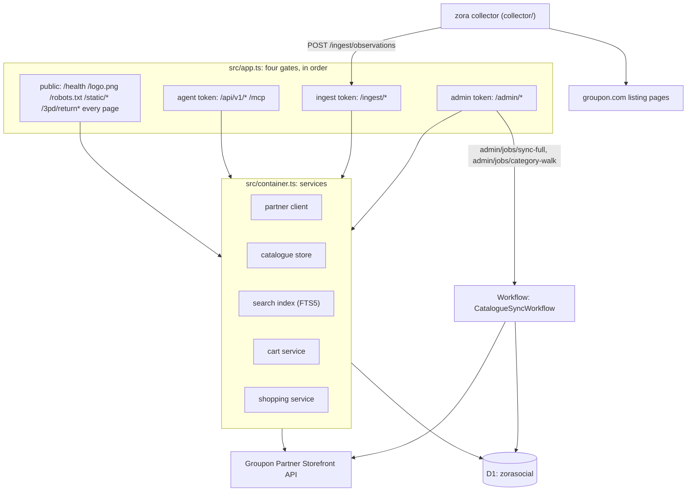

<!-- Module: docs/architecture.md · Tested: n/a -->
# Zora Agent Lab: architecture

## System

## Scheduled jobs

From `SCHEDULE` in `src/cron.ts`.

| Cron | Job | What it does |
|---|---|---|
| `0 */3 * * *` | `sync-delta` | Runs one delta walk of the catalogue with `updatedSince` set to the stored watermark, up to 40 pages, and records the result in `sync_runs`. |
| `0 4 * * *` | `probe` | Runs every probe check against the partner API and writes one `probe_runs` row with a pass/fail verdict. |
| `30 4 * * *` | `promo-gap` | Takes a snapshot of the promo gap across the whole catalogue. |
| `30 4 * * *` | `cart-sample` | Same time as `promo-gap`; creates a daily sample of test carts and records mismatches. |
| `15 * * * *` | `cart-sweep` | Abandons open carts: probe and monitor carts older than one hour, agent and web carts older than 24 hours (`SWEEP_AFTER_MS` in `src/carts/index.ts`). |
| `0 5 * * 1` | `sync-full` | Starts a full catalogue load as a Workflow instance, refusing while another full load is still running. |
| `30 0 * * *` | `top-cities` | Ranks the 50 cities with the most listable products into `top_cities`. |
| `30 0 * * *` | `category-walk` | Walks Groupon's 38 top categories with the `category1` filter, tagging `product_categories`, as one Workflow instance, things-to-do first. |

## D1 tables

Nine migration files, `migrations/0001` through `migrations/0009`. Writers below are the
migration files' own comments, checked against the code that runs the writing `INSERT`/`UPDATE`.

| Table | Holds | Writer | Reader |
|---|---|---|---|
| `products` | One row per product: title, description, status, listable flag, raw JSON, content hash | catalogue-store (`src/catalogue/`) | search, monitor, shopping |
| `options` | One row per product option: price, promo, active flag | catalogue-store | search, shopping, carts |
| `locations` | Fulfillment locations of a product | catalogue-store | shopping |
| `products_fts` | FTS5 index of listable products: title, descriptions, categories, places | catalogue-store | search |
| `sync_runs` | One row per sync walk: kind, status, cursor, pages, products, error log | sync (`src/sync/`) | sync status report |
| `sync_state` | The `last_refresh_at` watermark for the next delta | sync | sync |
| `price_changes` | One row per changed price field, old and new minor units | catalogue-store | monitor |
| `promo_gap_snapshots` | Daily snapshot: promo share, median and p90 gap, total gap | monitor (`src/monitor/`) | monitor read model |
| `cart_samples` | Daily sample of 20 test carts and their outcome | monitor | monitor read model |
| `public_price_observations` | Prices read from groupon.com listing pages by the collector | monitor (ingest route) | monitor read model |
| `guide_observations` | Guide version string seen by the collector | monitor (ingest route) | monitor read model |
| `probe_runs` | One row per daily probe run: verdict, passed, failed, skipped | probe-runner (`src/probe/run.ts`) | scorecard read model |
| `probe_steps` | One row per check step: verdict, HTTP status, latency, request id | probe-runner | scorecard read model |
| `contract_snapshots` | Latest known value per kind (openapi hash, guide version) | probe-runner | probe checks |
| `drift_events` | A recorded change in `contract_snapshots` | probe-runner | scorecard read model |
| `carts_log` | Every cart created: source, status, total, line count | carts (`src/carts/`) | monitor, scorecard |
| `orders` | Orders seen by the return page or a manual lookup: status, cached view, raw booking JSON | return page and shopping | return page, agent API |
| `agent_requests` | One row per agent/API call: channel, tool, outcome, latency | shopping (`src/shopping/`) | scorecard, price truth |
| `findings` | What stopped the team, what the guide did not say: area, expected, observed, severity | probe-runner (hand-kept) | scorecard read model |
| `auth_attempts` | Unused since the PIN gate was removed on 2026-09-30; kept so migrations stay append-only | nobody | nothing |
| `job_runs` | One row per job run: job name, ok, started, finished, summary | `src/cron.ts` | admin, ops |
| `rate_windows` | Request counters per minute for the return page's pacer | `src/lib/rate.ts` (used by `src/return/routes.ts`) | return page |
| `product_categories` | Groupon's `category1` tag per product, set by the daily category walk | sync (`src/sync/`) | top-deals read model |
| `top_cities` | The 50 cities with the most listable products, ranked, refreshed daily | top-deals (`src/top-deals/`) | top-deals read model |

## Guards added by the reviews

From `docs/ops/loop1.md`. The public return page (`src/return/routes.ts`) is capped so it cannot
turn a public page into a Groupon call on every request: the last order view is served from D1
while it is fresh (3 seconds while an order is pending, 60 seconds once it has settled), and reads
of Groupon are also capped at 30 a minute over every order together, through `rate_windows`.

The partner client shares one pacer (`Pacer` in `src/contracts/ports.ts`, built once per isolate in
`src/container.ts`): a request either gets the next free second-wide slot or, when the queue is
longer than `maxWaitMs` (15 seconds), it is answered `BUSY` without being sent at all, so a burst of
callers cannot queue for minutes.

Every product write happens as one transaction: `CatalogueStore.upsertProducts`
(`src/catalogue/`) writes a product, its options and its locations together, so a batch failure
cannot leave a product with options missing.

`CatalogueStore.markUnavailable` (`src/catalogue/`) is called whenever Groupon refuses an option in
a cart, by `src/shopping/index.ts` (checkout) and by the daily cart sample. It sets the option
inactive and clears the product's stored content hash, so the option stops being offered and the
next sync writes Groupon's own state back.

## Request path: "a massage in Chicago" to a checkout link

1. The agent calls `create_checkout_link` (or `POST /api/v1/checkout`) with items
   `{ productId, optionId, quantity }`. MCP validates the arguments in
   `validateCreateCheckoutLink` (`src/agent/mcp/schemas.ts`); the HTTP route validates the body in
   `parseCheckoutBody` (`src/agent/api/checkout-body.ts`). Both cap the request at 1 to 20 items,
   quantity 1 to 100.
2. Both call `ShoppingService.createCheckoutLink` (`src/shopping/index.ts`). It first checks the
   item count and quantities again, then for each item reads the product and option from the local
   catalogue copy with `CatalogueStore.getProduct` and fails with `not_found` or `unavailable` if
   the product or option is missing or no longer sellable.
3. `createCheckoutLink` builds one `CartLineRequest` per item, with `expectedPriceMinor` set to the
   option's stored `retail`, and calls `CartService.create` (`src/carts/index.ts`) once.
4. `CartService.create` refuses a malformed request locally (no API call), or calls
   `PartnerClient.createCart` (`src/partner/`) exactly once, sending every line together. A price
   mismatch becomes `price_changed`; a refused product or option becomes `unavailable`; success logs
   the cart in `carts_log` and returns the created `OctoCart`.
5. Back in `createCheckoutLink`, an `unavailable` outcome calls `CatalogueStore.markUnavailable` on
   the refused line before answering. A `created` outcome maps the cart's own fields into a
   `CheckoutResult` of kind `link`, using `cart.buyLink` verbatim and the cart's own totals and
   currency precision.
6. The HTTP route or the MCP tool returns the result: `link` as HTTP 200 with `buyLink`,
   `price_changed` and `unavailable` as HTTP 409, `not_found` as HTTP 404, `error` as HTTP 502
   (`CHECKOUT_STATUS` in `src/agent/api/routes.ts`; `isError` in `src/agent/mcp/tools.ts`).

One partner call is made for the whole checkout: `CartService.create` sends every requested line in
its single `createCart` call, not one call per item.

Every page request also carries the visitor's look: `POST /theme` sets `zal_theme` (`lab` or
`pixel`) as a year-long cookie and sends the visitor back to the page the switch was pressed on;
every page read checks that cookie and renders `data-theme="pixel"` on `<html>` when it is set, so
the pixel stylesheet (`public/static/pixel.css`) applies before anything paints, next to the lab
look's default `public/static/app.css`.

`/find` answers a visitor's own search the same way: `queryOf` (`src/ui/routes.ts`) reads `text`, a
`state` or `city` (or the shared `place` picker, "City, ST"), `category1` and a max price into one
`SearchQuery`, calls `ShoppingService.searchDeals` once and renders the result through
`renderFinder`. Its two pickers, the 50 cities and the categories, come from the same read model as
Top deals, `GET /data/pickers.json` (`reports.topDeals.pickers()`).
